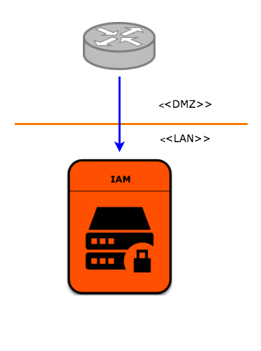

# Simplified setup for WSO2 kubernetes Identity Server

## Contents
* Prerequisites

* Quick Start Guide

## Prerequisites
* Install [Kubernetes  Client](https://kubernetes.io/docs/tasks/tools/install-kubectl/) in order to run the steps provided in the following quick start guide.
* An already setup Kubernetes cluster. If you are unfamiliar with this context, you can use [this guide](https://kubernetes.io/docs/setup/pick-right-solution/) to set up the cluster.
* WSO2 subscribed users can run **wso2is-latest.sh** with latest updates by providing their subscription username and password. If you do not possess an active WSO2 subscription already, run **wso2is-ga.sh** which does not require subscription credentials.

## Quick Start Guide
1. Download simplified kubernetes setup for WSO2 Identity Server (either **wso2is-latest.sh** or **wso2is-ga.sh**).From this point forward the steps are being described for wso2is-latest.sh. If you have downloaded wso2is-ga.sh please substitute wso2is-latest.sh with wso2is-ga.sh for every command.

2. In the command line, move into the directory where you have downloaded the simplified kubernetes-apim setup. (Usually, the file would be in the “Downloads” directory unless you have changed the default directory to somewhere else.)
3. Provide permissions for the setup file to execute by running **chmod +x wso2is-latest.sh**
4. Run **./wso2is-latest.sh --deploy** on your terminal. This will deploy WSO2 Identity Server in your cluster.

5. Try navigating to https://< NODE-IP >:30443/carbon/ your favourite browser using username: admin and password: admin. Your < NODE-IP > will be provided at the end of the deployment.
6. We welcome you to try out WSO2 Identity Server by following **[WSO2 Identity Server - Quick Start Guide](https://docs.wso2.com/display/IS570)**.
